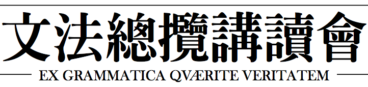

  

**문법총람강독회**(Reference Grammar Reading Group) 또는 **문총강**은 세계 언어의 다양성을 충분히 접할 기회를 얻기 위하여, 잘 알려지지 않고 사용인구가 적은 언어들의 문법총람을 최대한 많이 읽기 위해 발족하였습니다. 현재 언어와 언어학에 대단한 의지를 가진 학부생들과 대학원생들로 이뤄져있으며, 반년을 한 기수 단위로 회원을 모집하고 스터디를 진행하고 있습니다. 스터디는 훌륭하게 기술되었다고 판단되는 문법서를 선정하여 자신이 원하는 부분을 발췌하고 돌아가며 발제하는 형식으로 진행됩니다.

## 문총강 3기

문법총람강독회 3기(2018년 3월 ~ 8월)는 다음과 같이 진행될 예정입니다.

*   발제자: 김민규, 김성, 양재영, 최홍범
*   비발제 참가자: 박기효, 박하선, 차호주
*   발제 언어: Chukchi, Kri, Pacoh, Lezgian, Matses
*   시간 및 장소: 매주 수요일 7시 ~ 9시, 서울대학교 관악캠퍼스 및 한국외대 서울캠퍼스
*   발제 형식
    *   각 발제자 당 30분 이내
    *   첫 발제자가 문법서를 적당히 분할하여 발제 1회 분량을 제시한다
    *   각 언어의 문법서를 발제자들이 돌아가며 발제
*   발제문 작성 원칙
    *   한국어로 번역, 내용을 요약함을 원칙
    *   발제문만으로 문법서의 대략적인 내용을 파악할 수 있게
    *   LaTeX으로 편집 (텍 편집 교육 및 템플릿 제작: 김민규, 2월 한, 온라인)

3기 발제 편성은 다음 링크에서 확인할 수 있습니다. 
[https://goo.gl/VAoJRb](https://goo.gl/VAoJRb)

## 과거 발제 언어 목록
*Under Construction*

* 1기 (2017년 3월 ~ 8월)
  * Kayardild (호주)
  * Pite Saami (유럽)
  * Lakhota (북미)
  * Lango (아프리카)

* 2기 (2017년 9월 ~ 12월)
  * Chukchi (아시아)
  * Ik (아프리카)
  * Karam (태평양)

## Links

공유 링크: [https://goo.gl/3izhGP](https://goo.gl/3izhGP)

## Contact 

[regrregr@googlegroups.com](mailto:regrregr@googlegroups.com)

GitHub manager: [https://minkyu.kim/contact/](https://minkyu.kim/contact/)